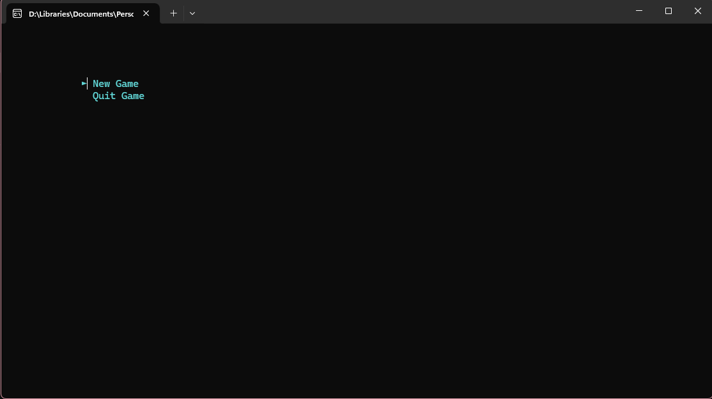
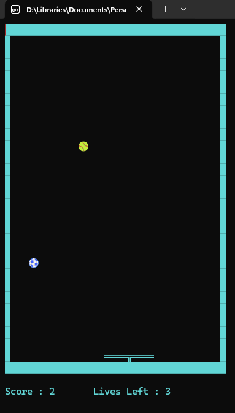

# A Simple Catch-the-ball the game
A simple, fun, and engaging **Catch the Ball** built using **C++** with Object-Oriented Programming (OOP) principles.

## Overview
This project is a console-based brick breaker game. The player controls a paddle at the bottom of the screen, aiming to catch the ball and avoid losing lives. The game implements key OOP concepts like encapsulation, inheritance, and polymorphism to manage game components effectively.

## Features
- **Object-Oriented Design**: The game is implemented using classes for modularity and reusability.
- **Dynamic Gameplay**: Increasing difficulty as you progress.
- **Score Tracking**: Tracks your score and remaining lives.
- **Unicode Characters**: Uses special Unicode characters for a visually appealing console interface.
- **Error Handling**: Includes robust handling for edge cases and user inputs.

## Screenshots
### Gameplay Screenshot 1:


### Gameplay Screenshot 2:


## Installation
1. Clone the repository:
   ```bash
   git clone https://github.com/TirdadMH/a-Simple-Ball-Catching-Game
   ```
2. Navigate to the project directory:
   ```bash
   cd a-Simple-Ball-Catching-Game
   ```
3. Open the project in Visual Studio:
   - Navigate to the project directory and open the .sln file.
   - Ensure that the required dependencies (if any) are installed.
   
4. Build the project:
   - In Visual Studio, select **Build > Build Solution** or press **Ctrl + Shift + B**.

5. Run the game:
   - Press F5 or select **Debug > Start Debugging** to run the game directly within Visual Studio.   

## Controls
- **A Key**: Move paddle left.
- **D Key**: Move paddle right.

## How It Works
### Classes
- **`Ball`**: Represents the ball's position and movement.
- **`Panel`**: Represents the paddle controlled by the player.
- **`GameRunner`**: Manages game logic, updates, and rendering.

### Key OOP Concepts
1. **Encapsulation**: Game properties (like ball speed, paddle position) are encapsulated within classes.
2. **Inheritance**: Specialized game components extend base functionality.
3. **Polymorphism**: Handles interactions between different objects (e.g., collision detection).

## Future Improvements
- Add power-ups (e.g., enlarge paddle, slow down ball).
- Implement different levels with increasing difficulty.
- Add sound effects.
- Create a GUI-based version.

## Acknowledgments
Special thanks to the C++ community for tutorials and support.

---
Feel free to contribute to the project and make it better! Open a pull request or raise an issue for suggestions.


